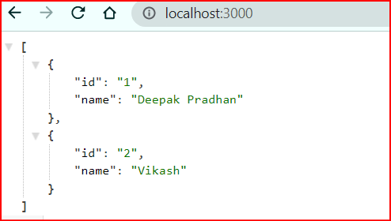

Node.js is a platform built on Chrome's JavaScript runtime for easily building fast, scalable network applications. Node.js uses an event-driven, non-blocking I/O model that makes it lightweight and efficient, perfect for data-intensive real-time applications that run across distributed devices.

It enables developers to use Javascript for the client side (front end) and the server side.

This tutorial is a reference on how I got started with it

1. Install Node.js - there are installers and packages for all the common operating systems which can be downloaded from here - http://nodejs.org/

If you are on windows I would suggest still using the 32bit version as some packages that you may need in the future may not work with the 64bit version.

Once installed to check it has installed open a command prompt window and run the following:

```
node --version
```

This should give you the current version of Node.js which is installed

You should also check to see if NPM (Node Package Manager - more on this later) has also installed, so run the following:

```
npm --version
```

Again this should give you the version of npm which is installed.

In order to build web applications we can use Express which is a web framework for Node.js. So we need to install Express and its counterpart Express-Generator.

To install these packages we can use the Node Package Manager (NPM). There are tens of thousands of packages/modules that people have written and released which means we have to write less code!!

So to install Express there are two ways to install it. The first will install it to the local working folder.

```
npm install express
```

But we can also install it globally so that we can call on Express from whichever folder we are working in.

```
npm install -g express
```

Once these packages have been installed we can now run the app by running:

App Start

```
npm start
```

Open a web browser and type the following address:

http://localhost:3000

# About the project

Inside this project I have passing the simple JSON response by using node.js .

And after that I have created Dockerfile to build the docker image by using this command 

```
docker build -t nodeapp .
```

After that to create a container for that image, so we can run that image, we need to use the below command

```
docker run -d -p 3000:9000 --name deepakapplication nodeapp
```

Output of my Express web application


